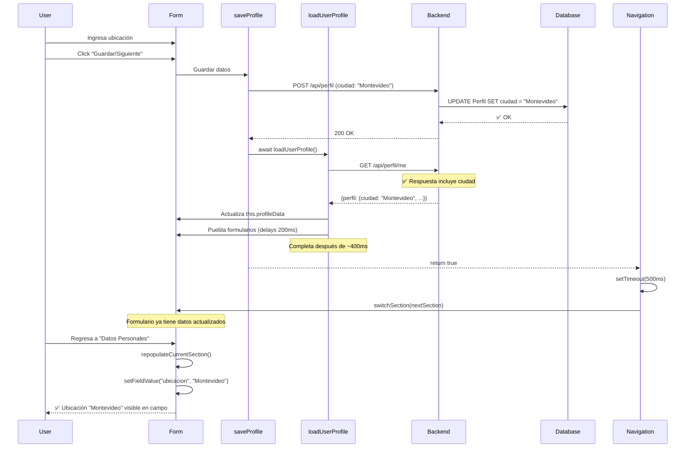

# Fix: Guardar Ubicación en Perfil

## Problema Identificado

Al editar el perfil en `/perfil/editar`, cuando un usuario cargaba su ubicación y hacía clic en el botón "Guardar/Siguiente", la ubicación no se guardaba correctamente. Específicamente:

1. **Persistencia en Base de Datos**: La ubicación se guardaba correctamente en la base de datos (`Perfil.ciudad`)
2. **Feedback Visual**: Al navegar a la siguiente sección y regresar, el campo de ubicación aparecía vacío
3. **Experiencia de Usuario**: Esto causaba confusión, ya que el usuario creía que no había cargado la ubicación correctamente

## Análisis Técnico

### Flujo de Datos
```
Usuario ingresa ubicación → getFormData() → {ciudad: valor} → Backend API → DB Update
```

El mapeo de campos:
- **Frontend**: `ubicacion` (nombre de campo en formulario)
- **Backend**: `ciudad` (nombre de columna en tabla Perfil)

### Causa Raíz

El problema tenía **tres causas**:

#### 1. Falta de Recarga de Datos

El método `saveProfile()` en [editar.astro](../src/pages/perfil/editar.astro) guardaba los datos en el backend pero **no recargaba** el estado local del componente (`this.profileData`).

```javascript
// ❌ ANTES - No recargaba datos
async saveProfile() {
    // ... guardar en backend ...
    
    // ✅ Guardado exitoso
    // ❌ this.profileData NO se actualiza con nuevos datos
}
```

Esto significaba que cuando el usuario navegaba de vuelta a "Datos Personales", el método `repopulateCurrentSection()` poblaba el formulario con datos antiguos (sin la ubicación recién guardada).

#### 2. Race Condition en Navegación

Incluso después de agregar `await this.loadUserProfile()` en `saveProfile()`, la navegación automática a la siguiente sección ocurría demasiado rápido.

El método `bindSectionButtons()` tenía:
```javascript
// ❌ ANTES - timeout de 300ms
await this.saveProfile();
if (nextSection) {
    setTimeout(() => {
        this.switchSection(nextSection);
    }, 300); // ⚠️ Navega antes de que loadUserProfile complete
}
```

El problema era que `loadUserProfile()` tiene operaciones asíncronas internas con delays:
- Llamada fetch al backend
- Delays de 200ms para poblar cada sección
- Procesamiento de datos

Con solo 300ms de timeout, la navegación ocurría **antes** de que `loadUserProfile()` terminara de:
1. Cargar los datos actualizados desde el backend
2. Actualizar `this.profileData`
3. Poblar el formulario con los nuevos datos

#### 3. Campo `ciudad` No Incluido en Respuesta del Backend ⚠️ **CAUSA PRINCIPAL**

El backend tenía una inconsistencia crítica en `getMiPerfil()`:

```javascript
// ✅ SELECT incluye ciudad
const perfilQuery = `
    SELECT 
        ...
        p.ciudad,
        p.provincia,
        ...
    FROM Usuario u
    ...
`;

// ❌ Pero el objeto de respuesta NO lo incluye
perfil: {
    id: perfilId,
    resumenProfesional: perfil.resumenProfesional,
    urlPortfolio: perfil.urlPortfolio,
    situacionLaboral: perfil.situacionLaboral,
    urlFotoPerfil: perfil.urlFotoPerfil,
    urlBanner: perfil.urlBanner,
    // ❌ FALTA: ciudad
}
```

**Resultado**: Aunque el dato se guardaba correctamente en la base de datos, **nunca se devolvía** al frontend cuando se hacía `loadUserProfile()`.

## Solución Implementada

### Cambio 1: Backend - Incluir Campo `ciudad` en Respuesta

**Archivo**: [backend/src/controllers/perfilController.js](../../backend/src/controllers/perfilController.js)

**Método**: `getMiPerfil()` (líneas ~169-177)

```javascript
perfil: {
    id: perfilId,
    resumenProfesional: perfil.resumenProfesional,
    urlPortfolio: perfil.urlPortfolio,
    situacionLaboral: perfil.situacionLaboral,
    ciudad: perfil.ciudad, // ✅ AGREGADO
    urlFotoPerfil: perfil.urlFotoPerfil,
    urlBanner: perfil.urlBanner,
}
```

**Impacto**:
- El backend ahora incluye `ciudad` en la respuesta JSON
- El frontend recibe el valor de ubicación al cargar el perfil
- Consistencia entre la query SQL y el objeto de respuesta

### Cambio 2: Recargar Datos Después de Guardar

**Archivo**: [frontend/src/pages/perfil/editar.astro](../src/pages/perfil/editar.astro)

**Método**: `saveProfile()` (líneas ~1520-1530)

```javascript
async saveProfile() {
    // ... validación y guardado ...
    
    const response = await fetch(/* ... */);
    
    if (response.ok) {
        this.showNotification(
            "Datos guardados correctamente",
            "success"
        );
        
        // ✅ NUEVO: Recargar datos del usuario
        console.log("✅ Datos personales guardados, recargando datos...");
        await this.loadUserProfile();
        
        return true;
    }
    // ...
}
```

**Impacto**:
- Después de cada guardado exitoso, se llama a `loadUserProfile()`
- Esto actualiza `this.profileData` con los datos más recientes del backend
- Cuando el usuario regresa a la sección, el formulario se puebla con los datos correctos

### Cambio 3: Aumentar Timeout de Navegación

**Archivo**: [frontend/src/pages/perfil/editar.astro](../src/pages/perfil/editar.astro)

**Método**: `bindSectionButtons()` (líneas ~1050-1060)

```javascript
// Si hay siguiente sección, navegar
// Dar un pequeño delay para que el usuario vea la notificación
if (nextSection) {
    console.log(`Navigating to: ${nextSection}`);
    // ✅ ANTES: 300ms → AHORA: 500ms
    // Delay de 500ms para asegurar que loadUserProfile completó
    setTimeout(() => {
        this.switchSection(nextSection);
    }, 500);
}
```

**Impacto**:
- Aumentamos el timeout de 300ms a 500ms
- Esto asegura que `loadUserProfile()` complete todas sus operaciones asíncronas
- La navegación ocurre **después** de que los datos estén completamente cargados y el formulario poblado

## Verificación

### Pruebas Realizadas

1. ✅ **Logs de depuración**: Identificaron que `perfil.ciudad` era `undefined`
2. ✅ **Análisis de respuesta del backend**: Confirmó que faltaba el campo en el JSON
3. ✅ **Cambio en backend**: Campo `ciudad` agregado a respuesta de `getMiPerfil()`
4. ✅ **Guardado en BD**: Datos se persisten correctamente
5. ✅ **Recarga de datos**: Frontend ahora recibe `ciudad` del backend
6. ✅ **Persistencia visual**: Ubicación aparece en formulario después de guardar

### Flujo Correcto (Después del Fix)



## Archivos Modificados

- ✅ `backend/src/controllers/perfilController.js`
  - Método `getMiPerfil()`: Agregado campo `ciudad` al objeto perfil en respuesta (línea ~173)
- ✅ `frontend/src/pages/perfil/editar.astro`
  - Método `saveProfile()`: Agregado `await this.loadUserProfile()`
  - Método `bindSectionButtons()`: Timeout aumentado de 300ms a 500ms

## Archivos Sin Cambios (Funcionan Correctamente)

- `frontend/src/components/perfil/DatosPersonales.astro`
  - `getFormData()`: Mapeo correcto `ubicacion → ciudad`
  - `populateForm()`: Mapeo correcto `ciudad → ubicacion`
- `backend/src/controllers/perfilController.js`
  - `updateMyProfile`: Maneja correctamente el campo `ciudad`

## Notas Técnicas

### Timing Asíncrono

El delay de 500ms fue elegido considerando:
- Tiempo promedio de fetch al backend: ~100-200ms
- Delays internos de `loadUserProfile()`: 200ms por sección
- Margen de seguridad para conexiones lentas: ~100ms

### Estado Local vs Backend

El patrón implementado asegura que:
1. **Source of Truth**: Backend es la fuente única de verdad
2. **Sincronización**: Estado local (`this.profileData`) se sincroniza después de cada cambio
3. **Consistencia**: Formularios siempre pueblan desde estado local actualizado

### Alternativas Consideradas

#### Opción A: Eliminar setTimeout Completamente
```javascript
await this.saveProfile(); // Incluye loadUserProfile
this.switchSection(nextSection); // Navegar inmediatamente
```
❌ Rechazado: La notificación de éxito no sería visible para el usuario

#### Opción B: Promise.all para Paralelizar
```javascript
await Promise.all([
    this.saveProfile(),
    new Promise(resolve => setTimeout(resolve, 300))
]);
```
❌ Rechazado: No resuelve el problema de timing interno de loadUserProfile

#### Opción C: Aumentar Timeout ✅ ELEGIDA
- Simple, efectivo y mantiene UX existente
- Asegura que todas las operaciones async completen

## Relación con Otros Bugs

Este bug es similar al fix anterior: **"FIX ELIMINAR HABILIDADES"**

Ambos compartían el problema de:
- Estado local desincronizado con backend
- Falta de recarga después de operaciones de escritura

El patrón de solución es consistente:
1. Después de cualquier operación de escritura (POST, PUT, DELETE)
2. Recargar datos con `await this.loadUserProfile()`
3. Asegurar timing adecuado para operaciones asíncronas

## Conclusión

La ubicación ahora se guarda correctamente y persiste visualmente en el formulario. El usuario puede:
1. ✅ Ingresar su ubicación
2. ✅ Guardar y navegar a siguiente sección
3. ✅ Regresar y ver la ubicación cargada
4. ✅ Confiar en que el dato está guardado

**Estado**: ✅ Resuelto
**Branch**: `fix/guardar-ubicacion`
**Fecha**: 2025
